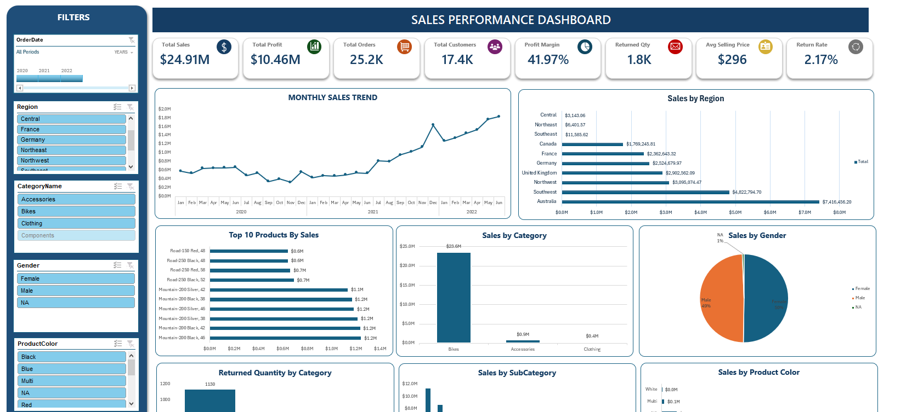
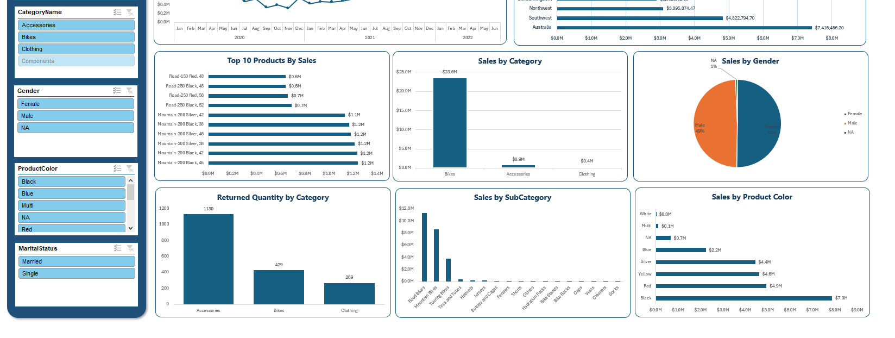

# 📊 Sales Performance Dashboard (Excel)

Interactive Sales Performance Dashboard built in Microsoft Excel using **Power Query, Power Pivot, DAX, PivotTables, PivotCharts, Slicers, and Timeline**  designed to transform raw sales data into an interactive business reporting solution.

## 📊 Overview

This project transforms raw sales data into a fully interactive Excel dashboard for analyzing **sales performance, profitability, customers, products, regions, and returns**.

Users can dynamically explore the data using **slicers and a timeline** to filter the dashboard by date, region, category, gender, product color, and marital status.

The dashboard provides a centralized view of key sales KPIs and performance trends, helping users identify patterns and make data-driven decisions without manually analyzing large datasets.

## ✨ Features

* **8 Interactive KPI Cards** — Total Sales, Total Profit, Total Orders, Total Customers, Profit Margin, Returned Quantity, Average Selling Price, and Return Rate
* **Monthly Sales Trend** — Sales performance tracked across 2020–2022
* **Regional Analysis** — Compare sales performance across regions
* **Top 10 Products** — Identify the highest-performing products by sales
* **Category Analysis** — Analyze sales performance across product categories
* **Subcategory Analysis** — Compare performance across product subcategories
* **Customer Analysis** — Sales breakdown by gender and marital status
* **Product Color Analysis** — Analyze sales performance by product color
* **Returns Analysis** — Monitor returned quantity by product category
* **Interactive Slicers** — Filter the dashboard by region, category, gender, color, and marital status
* **Timeline Filter** — Analyze sales performance dynamically by date
* **Integrated Dashboard** — All visualizations and KPIs update based on selected filters

## 🖼️ Dashboard Preview

### Dashboard Overview

## 🛠️ Tech Stack

* **Microsoft Excel** — Dashboard development and visualization
* **Power Query** — Data cleaning and transformation
* **Power Pivot** — Data modeling and table relationships
* **DAX** — Business calculations and KPI measures
* **PivotTables** — Data analysis and summaries
* **PivotCharts** — Interactive data visualization
* **Slicers & Timeline** — Dynamic dashboard filtering

## 🚀 How to Use

1. Download `Sales Performance Dashboard.xlsx`
2. Open the workbook in Microsoft Excel
3. Enable content if Excel displays a security prompt
4. Open the **Dashboard** sheet
5. Use the **slicers and timeline** to filter the dashboard
6. Select different regions, categories, customer segments, or dates to explore the analysis
7. Review the KPI cards and charts to identify sales and profitability trends

## 📌 Key Learnings

This project demonstrates:

* Building an end-to-end Excel analytics solution from raw data to interactive dashboard
* Cleaning and transforming datasets using **Power Query**
* Creating a relational data model using **Power Pivot**
* Developing business KPIs and analytical measures using **DAX**
* Building interactive dashboards using **PivotTables and PivotCharts**
* Connecting multiple dashboard components through **slicers and timelines**
* Analyzing sales, profitability, customers, products, regions, and returns
* Designing dashboards focused on practical business decision-making

## 🎯 Who This Dashboard Is For

This dashboard is designed for:

* **Sales Managers** — to monitor sales and profitability performance
* **Business Teams** — to identify product, customer, and regional trends
* **Decision-Makers** — to quickly evaluate KPIs and performance
* **Analysts** — to explore sales data through interactive filtering

### Business Questions Answered

* How are sales performing over time?
* Which regions generate the highest sales?
* Which products contribute the most revenue?
* Which categories and subcategories perform best?
* How profitable is the business?
* Which customer segments contribute most to sales?
* How many products are being returned?
* How does return performance vary across categories?

## 📄 License

This project is licensed under the MIT License — see the (LICENSE) file for details.

---

**Author:** Mueeza Irfan
